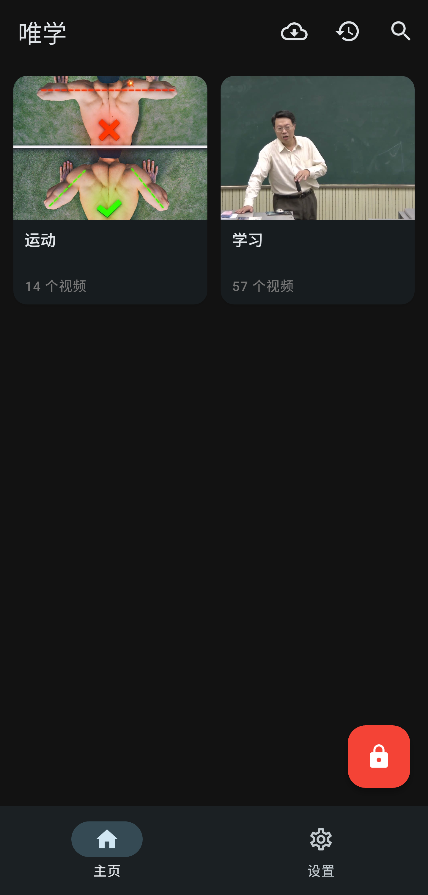
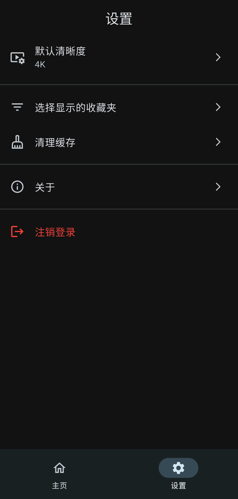

# 唯学

唯学是一款专为学习设计的沉浸式 Bilibili 视频播放器。它允许用户只能观看特定的收藏夹内容，过滤掉主页的干扰信息，并提供锁定功能以确保专注的学习环境

## ✨ 主要功能

- **专注模式**: 仅显示您选定的收藏夹视频。过滤掉 Bilibili 主页的推荐流，拒绝信息干扰
- **安全锁定**: 支持密码锁定收藏夹配置。一旦锁定，必须输入密码才能修改显示的收藏夹，有效防止拖延和分心
- **高性能播放器**: 基于 `media_kit` 构建，提供流畅的硬件加速播放体验
- **离线缓存**: 支持视频下载与离线播放。支持后台下载和任务管理。
- **多语言支持**: 完整支持简体中文和英文

> 欢迎大家提出功能需求！

## 🛠️ 技术栈

- **框架**: [Flutter](https://flutter.dev/)
- **视频播放**: [media_kit](https://pub.dev/packages/media_kit)
- **网络请求**: [Dio](https://pub.dev/packages/dio)
- **本地数据库**: [sqflite](https://pub.dev/packages/sqflite)
- **图片缓存**: [cached_network_image](https://pub.dev/packages/cached_network_image) & [flutter_cache_manager](https://pub.dev/packages/flutter_cache_manager)

## 🚀 开始

### 一、使用打包好的安装包

- 根据设备类型[下载](https://github.com/conradsheeran/onlystudy/releases)安装
- 注意：仅对安卓设备进行了测试，其它设备如果出现问题，欢迎提交 issue
- 由于没钱开通苹果开发者账号，因此苹果设备请自行构建打包

### 二、自行构建安装

#### 1. 环境要求

- Flutter SDK (3.10.0 或更高版本)
- Android Studio / Xcode (移动端开发)
- Visual Studio / C++ Build Tools (Windows 开发)

#### 2. 安装步骤

1.  **克隆仓库**
    ```bash
    git clone https://github.com/conradsheeran/onlystudy.git
    cd onlystudy
    ```

2.  **安装依赖**
    ```bash
    flutter pub get
    ```

3.  **生成本地化文件**
    ```bash
    flutter gen-l10n
    ```

4.  **运行应用**
    ```bash
    flutter run
    ```

## 📱 项目结构

```
lib/
├── l10n/               # 本地化文件 (.arb)
├── models/             # 数据模型 (Video, Folder 等)
├── screens/            # UI 页面 (Home, Player, Login 等)
├── services/           # 业务逻辑服务 (Auth, API, DB, Download)
├── theme/              # 应用主题配置
├── widgets/            # 可复用的 UI 组件
└── main.dart           # 程序入口
```

## 📸 应用截图

| 首页 | 视频列表 | 设置页面 |
| :------: | :----------: | :----------: |
|  |  |  |

## 📝 使用指南

1.  登录: 使用 哔哩哔哩 手机客户端扫描二维码登录
2.  选择内容: 登录后，勾选您希望在主页显示的收藏夹
3.  锁定设置: 点击右下角的锁定图标。您可以设置一个密码来锁定当前的显示配置，防止随意修改
    - 锁定状态: 红色锁图标，长按并输入密码解锁
    - 解锁状态: 正常主题色图标，点击即可快速锁定
4.  开始学习: 浏览您精选的视频列表，支持搜索收藏夹内容，或缓存视频以便离线学习

- **建议先将网课添加到一个专门的收藏夹，然后使用系统自带的屏幕使用时间设置只允许该应用使用，密码让别人设置，这样你除了发呆就只能学习**

## ✈️ 开发计划

- [x] 优化播放器体验（倍速、手势操作等）
- [ ] 增加统计单日学习时长的功能
- [ ] 增加后台播放的功能
- [ ] 优化断点续播功能

---
*注意：本项目为第三方客户端，仅供学习交流使用，与哔哩哔哩官方无关*
